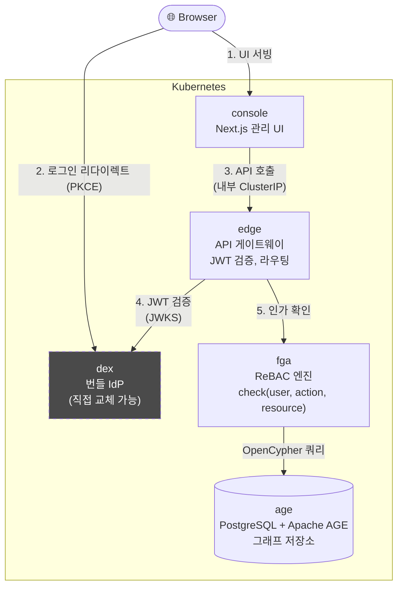
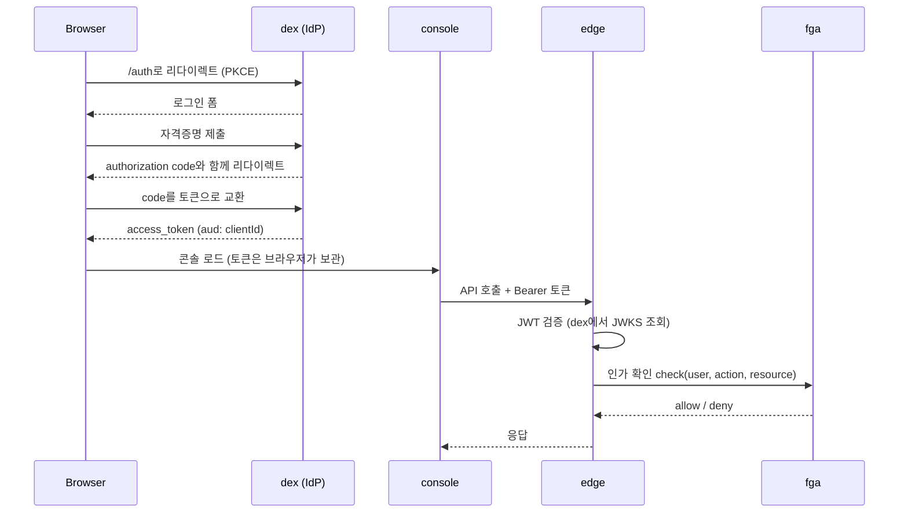

# cubefin-iam

**CubeFin IAM** — MSA/SaaS 환경을 위한 독립형 인가(Authorization) 엔진입니다. 그래프 데이터베이스
기반의 ReBAC(Relationship-Based Access Control)를 제공하며, 이미 보유하고 있는 어떤 OIDC
IdP와도 연동되는 게이트웨이가 앞단에 서 있습니다.

`helm install` 한 번이면 데모 로그인 계정까지 포함된 완전한 스택이 바로 뜹니다 — 별도로 외부
의존성을 먼저 구성할 필요가 없습니다.

> 🚀 **라이브 데모**: [iam.demo.cubefin.io](https://iam.demo.cubefin.io) — 로그인 계정은 아래 [라이브 데모](#라이브-데모) 참고
> 🏠 **홈페이지**: [www.cubefin.io](https://www.cubefin.io)
> 💬 **문의/상담**: [help@cubefin.io](mailto:help@cubefin.io)

## 라이브 데모

설치 없이 바로 체험: **[iam.demo.cubefin.io](https://iam.demo.cubefin.io)**

| 이메일 | 비밀번호 | 소속 |
|---|---|---|
| `demo@cubefin.io` | `cubefin-demo` | — (첫 로그인 후 admin 클레임용) |
| `viewer@cubefin.io` | `cubefin-viewer` | — (비관리자 뷰 확인용) |
| `alice.kim@demo.cubefin.io` | `cubefin-team` | Backend Team (manager) |
| `bob.lee@demo.cubefin.io` | `cubefin-team` | Backend Team (member) |
| `carol.park@demo.cubefin.io` | `cubefin-team` | Frontend Team (manager) |
| `dave.jung@demo.cubefin.io` | `cubefin-team` | Frontend Team (member) |
| `erin.choi@demo.cubefin.io` | `cubefin-team` | Platform/DevOps (member) |
| `frank.yoon@demo.cubefin.io` | `cubefin-team` | Design (member) |
| `grace.han@demo.cubefin.io` | `cubefin-team` | Product (manager) |
| `henry.oh@demo.cubefin.io` | `cubefin-team` | Sales (member) |
| `ivy.seo@demo.cubefin.io` | `cubefin-team` | Sales (manager) |
| `jack.moon@demo.cubefin.io` | `cubefin-team` | Finance (member) |

`demo@cubefin.io`로 먼저 로그인해서 **"Claim Admin Access"**를 클릭하세요. 그 다음 Groups
메뉴에서 Engineering(Backend/Frontend/Platform), Product(Design), Sales, Finance로 구성된
조직 트리를, Users 메뉴에서 위 계정들이 각 그룹에 배정된 모습을 볼 수 있습니다. 데모 환경은
주기적으로 초기화되며, 이미 다른 사람이 관리자 권한을 선점했다면 그 때문입니다. 직접 설치해보고
싶다면 아래 [빠른 시작](#빠른-시작)을 참고하세요.

## 아키텍처



`edge`와 `fga`는 표준 OIDC 디스커버리(`quarkus-oidc`)로 토큰을 검증합니다 — 특정 IdP에 종속된
코드가 전혀 없습니다. Dex(기본 번들), Keycloak, Auth0, Cognito, Google Identity 등 표준
OIDC/OAuth2 IdP라면 무엇이든 사용할 수 있습니다. `edge`의 인그레스는 **기본적으로 꺼져 있습니다** —
콘솔은 모든 API 호출을 내부 ClusterIP로 처리하므로, `edge` 게이트웨이를 통해 외부 서비스를
직접 라우팅(`edge.config.additionalRoutes`)하려는 경우가 아니라면 `edge`를 외부에 노출할 필요가
없습니다.

### 로그인 + 인가 흐름



## 구성 요소

| 구성 요소 | 설명 |
|-----------|-----------|
| **edge** | Quarkus API 게이트웨이 — JWT 검증, 요청 라우팅, 경계 보안 |
| **fga** | 세밀한 인가(Fine-Grained Authorization) 엔진 — 그래프 기반 `check(user, action, resource)`, TOFU 부트스트랩 |
| **age** | PostgreSQL + [Apache AGE](https://age.apache.org/) — `fga`가 사용하는 그래프 저장소 (OpenCypher) |
| **console** | Next.js 관리 UI — 사용자/그룹/리소스 관리, 감사 로그 조회 |
| **dex** | 번들로 포함된 [Dex](https://dexidp.io/) OIDC 프로바이더 — 바로 로그인해볼 수 있는 레퍼런스 IdP. 운영 환경에서는 직접 교체하세요. |

## 사전 준비물

- 기본 StorageClass가 설정된 쿠버네티스 클러스터 (`age`의 Postgres PVC용)
- 인그레스 컨트롤러로 `ingress-nginx` 설치 (차트 기본값이 `className: nginx`를 가정)
- 인그레스에 연결할 **호스트네임 2개**에 대한 DNS 관리 권한 — 아래 참고

## 빠른 시작

1. **호스트네임 2개**를 정하고 인그레스 컨트롤러로 DNS를 연결하세요:

   | 기본값(placeholder) | 용도 |
   |---|---|
   | `idp.example.com` | Dex (번들 IdP) — 브라우저가 로그인하는 곳 |
   | `auth.example.com` | Console (관리 UI) |

   `dex.staticClient.redirectURIs`는 콘솔 호스트와 정확히 일치해야 합니다(스킴 + 호스트,
   경로 없이) — 위 두 기본값은 이미 서로 일치하도록 되어 있으니, 하나를 바꾸면 다른 하나도
   반드시 같이 바꿔야 합니다.

   > 두 호스트네임 모두 브라우저뿐 아니라 **클러스터 내부에서도** resolve되어야 합니다 —
   > `edge`/`fga`가 서버 사이드에서 Dex로부터 서명 키를 가져오기 때문입니다. 클러스터가 자신의
   > 공인 인그레스 호스트네임으로 되돌아가는 라우팅이 안 되는 경우(일부 네트워크에서 흔한
   > "hairpin NAT" 제약), `global.oidc.internalIssuer`를 클러스터가 실제로 도달 가능한
   > 주소로 설정하세요(예: Dex의 클러스터 내부 Service). [값 참조](#값-참조) 참고.

2. **설치:**

   ```bash
   helm install cubefin-iam oci://ghcr.io/cubefin/cubefin-iam \
     -n cubefin --create-namespace \
     --set dex.ingress.host=idp.yourcompany.com \
     --set dex.issuer=https://idp.yourcompany.com \
     --set global.oidc.issuer=https://idp.yourcompany.com \
     --set dex.staticClient.redirectURIs[0]=https://auth.yourcompany.com \
     --set console.ingress.host=auth.yourcompany.com
   ```

   또는 values 파일을 사용하는 방법 (override가 2개 이상이면 이쪽을 권장합니다):

   ```yaml
   # my-values.yaml
   global:
     oidc:
       issuer: "https://idp.yourcompany.com"
   dex:
     ingress:
       host: "idp.yourcompany.com"
     issuer: "https://idp.yourcompany.com"
     staticClient:
       redirectURIs:
         - "https://auth.yourcompany.com"
   console:
     ingress:
       host: "auth.yourcompany.com"
   # edge 게이트웨이로 외부 서비스를 라우팅하는 경우에만:
   # edge:
   #   ingress:
   #     enabled: true
   #     host: "edge.yourcompany.com"
   ```

   ```bash
   helm install cubefin-iam oci://ghcr.io/cubefin/cubefin-iam \
     -n cubefin --create-namespace -f my-values.yaml
   ```

3. **로그인.** 콘솔 호스트(예: `https://auth.yourcompany.com`)로 접속하면 번들 Dex 로그인
   화면으로 리다이렉트됩니다 — **첫 번째** 내장 데모 계정으로 로그인하세요:

   | 항목 | 값 |
   |---|---|
   | 이메일 | `demo@cubefin.io` |
   | 비밀번호 | `cubefin-demo` |

   콘솔에서 **"Claim Admin Access"**를 눌러야 합니다. `fga`는 TOFU(Trust On First Use) 방식을
   사용합니다 — 누군가 명시적으로 클레임하기 전까지는 관리자가 아무도 없으며, 특정 계정에
   묶인 것이 아니라 먼저 클릭하는 사람이 관리자가 됩니다. 두 번째 데모 계정
   (`viewer@cubefin.io` / `cubefin-viewer`, 비관리자 세션이 어떻게 보이는지 확인용으로 포함)으로
   로그인하거나 설치본을 다른 사람에게 넘기기 전에 반드시 먼저 진행하세요.

   (실제 운영에 노출하기 전에는 이 계정들을 변경하거나 제거하세요 —
   [`dex.demoUsers`](charts/dex/values.yaml) 참고.)

## 실제 IdP로 전환하기

번들 Dex를 끄고 직접 보유한 OIDC 프로바이더를 지정하세요:

```yaml
dex:
  enabled: false

global:
  oidc:
    issuer: "https://your-idp.example.com/realms/yourrealm"   # Keycloak 예시
    clientId: "cubefin-iam"
    clientSecret: "<your client secret>"
    # issuer에 붙는 JWKS 경로 — 프로바이더마다 다릅니다:
    #   Dex:      /keys                              (기본값)
    #   Keycloak: /protocol/openid-connect/certs
    #   기타:      프로바이더의 디스커버리 문서에서 jwks_uri 확인
    jwksPath: "/protocol/openid-connect/certs"
```

IdP에 다음과 같이 클라이언트를 등록하세요:
- 리다이렉트 URI: `https://<콘솔 호스트>` (콘솔 자신의 origin — `react-oidc-context`는
  `/callback` 같은 서브패스가 아니라 앱 루트를 사용합니다)
- 가능하면 **public** 클라이언트 / PKCE 지원 (콘솔은 브라우저에서 client secret을 전송하지
  않습니다). IdP가 confidential 클라이언트만 지원하더라도 `edge`/`fga`는 서버 사이드에서
  문제없이 인증됩니다.

## 값 참조

### `global`

| 파라미터 | 설명 | 기본값 |
|---|---|---|
| `global.oidc.issuer` | 공인 OIDC issuer URL — 브라우저가 리다이렉트되는 주소이자 `iss`/`aud` 클레임 검증 기준 | `https://idp.example.com` (번들 Dex) |
| `global.oidc.internalIssuer` | `edge`/`fga`가 서버 간 디스커버리 + JWKS 조회에 사용하는 클러스터 내부 URL. `dex.enabled=true`일 때 번들 Dex의 Service로 자동 유도됨. 직접 보유한 IdP가 클러스터 내부에서 공인 `issuer`와 다른 주소를 필요로 하면 명시적으로 설정 | `""` (자동) |
| `global.oidc.clientId` | edge/fga/console이 공유하는 OAuth2 클라이언트 ID | `cubefin-client` |
| `global.oidc.clientSecret` | OAuth2 클라이언트 시크릿 (public Dex 클라이언트에서는 사용 안 함) | `change-me-secret` |
| `global.oidc.jwksPath` | 디스커버리 URL에 붙는 JWKS 경로 | `/keys` |
| `global.registryCredentials.enabled` | 이미지 pull secret 자동 생성 | `false` |
| `global.imagePullSecrets` | 기존 이미지 pull secret을 이름으로 사용 | `[]` |
| `global.otel.enabled` | edge/fga/console에 OpenTelemetry 자동 계측 | `false` |

### `dex` (번들 IdP)

| 파라미터 | 설명 | 기본값 |
|---|---|---|
| `dex.enabled` | 번들 Dex IdP 배포 여부 | `true` |
| `dex.ingress.host` | Dex의 공인 호스트네임 | `idp.example.com` |
| `dex.issuer` | Dex가 자신의 issuer로 보고하는 전체 외부 URL (인그레스 호스트와 일치해야 함) | `https://idp.example.com` |
| `dex.staticClient.redirectURIs` | 허용되는 브라우저 리다이렉트 대상 (`console.ingress.host`와 일치해야 함) | `["https://auth.example.com"]` |
| `dex.demoUsers` | 내장 데모 로그인 목록 — `[0]`으로 먼저 로그인해서 관리자 클레임(빠른 시작 3단계 참고) | `demo@cubefin.io` / `cubefin-demo`, `viewer@cubefin.io` / `cubefin-viewer` |

전체 옵션(이미지, 리소스, 비밀번호 해시 등)은 [`charts/dex/values.yaml`](charts/dex/values.yaml) 참고.

### `edge`, `fga`, `age`, `console`

| 파라미터 | 설명 | 기본값 |
|---|---|---|
| `edge.replicas` | Edge 게이트웨이 레플리카 수 | `1` |
| `edge.ingress.enabled` | edge를 외부에 노출 (외부 `additionalRoutes` 소비자가 있을 때만 필요) | `false` |
| `edge.ingress.host` | 활성화 시 API 게이트웨이의 공인 호스트네임 | `edge.example.com` |
| `fga.replicas` | FGA 엔진 레플리카 수 | `1` (`charts/fga/values.yaml`의 `replicaCount`) |
| `age.postgresql.storage` | 그래프 데이터베이스 PVC 크기 | `5Gi` |
| `console.ingress.host` | 관리 UI의 공인 호스트네임 | `auth.example.com` |

각 서브차트의 `values.yaml`에서 전체 옵션을 확인할 수 있습니다:
[`edge`](charts/edge/values.yaml) · [`fga`](charts/fga/values.yaml) · [`age`](charts/age/values.yaml) · [`console`](charts/console/values.yaml)

## 삭제

```bash
helm uninstall cubefin-iam -n cubefin
```

`age`의 PVC는 자동으로 삭제되지 않습니다 — 그래프 데이터까지 지우려면 직접 삭제하세요:
`kubectl delete pvc -n cubefin -l app.kubernetes.io/name=age`.

## 트러블슈팅

| 증상 | 유력한 원인 |
|---|---|
| 로그인 시 리다이렉트 루프 또는 "invalid redirect_uri" | `dex.staticClient.redirectURIs`가 `console.ingress.host`와 정확히 일치하지 않음 (스킴 + 호스트) |
| 콘솔 로드/로그인은 되는데 API 호출이 "Connection Error" / "OIDC Server is not available"로 실패 | `edge`/`fga`가 클러스터 내부에서 `global.oidc.issuer`에 도달하지 못함 (hairpin NAT가 흔한 원인). `global.oidc.internalIssuer`를 클러스터 내부에서 도달 가능한 주소로 설정 — [값 참조](#값-참조) 참고 |
| 콘솔은 로드되는데 API 호출이 401 | `global.oidc.jwksPath`가 실제 IdP의 JWKS 경로와 다름 — `<issuer>/.well-known/openid-configuration`에서 실제 `jwks_uri` 확인 |
| `age` 파드가 `Pending`에서 멈춤 | 클러스터에 기본 StorageClass가 없거나, 요청한 PVC 크기를 사용할 수 없음 |
| 이미지 pull 에러 | 이미지/차트가 아직 public이 아니거나, private 레지스트리라면 `global.imagePullSecrets`/`registryCredentials`가 실제 pull secret을 가리켜야 함 |

## 지원

- 🏠 홈페이지: [www.cubefin.io](https://www.cubefin.io)
- 💬 문의/상담: [help@cubefin.io](mailto:help@cubefin.io)
- 🐛 이슈 등록: [github.com/cubefin/helm-charts/issues](https://github.com/cubefin/helm-charts/issues)
